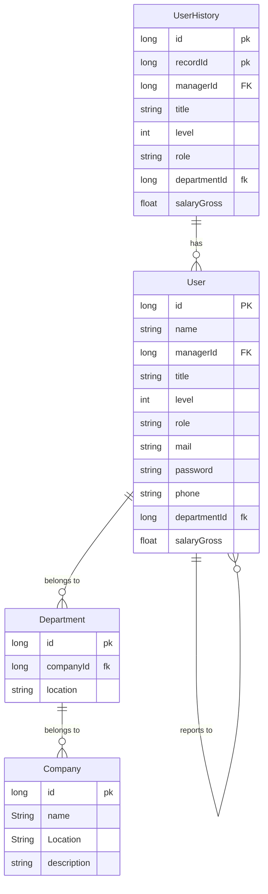

###                  Company Managment System
# ERD

```mermaid
erDiagram
User {
        long id PK
        string name
        long managerId FK
        string title
        int level
        string role
        string mail
        string password
        string phone
        long departmentId fk
        float salaryGross
    }
    Company{
        long id  pk
        String name  
        String Location
        string description
        }
    Department{
          long id pk
          long companyId fk
          string location
    }
    UserHistory{
        long id pk
        long recordId pk
       long managerId FK
        string title
        int level
        string role
        long departmentId fk
        float salaryGross
}
User ||--o{ Department : "belongs to"
Department ||--o{ Company : "belongs to"
User ||--o{ User : "reports to"
UserHistory ||--o{ User : "has"

```
