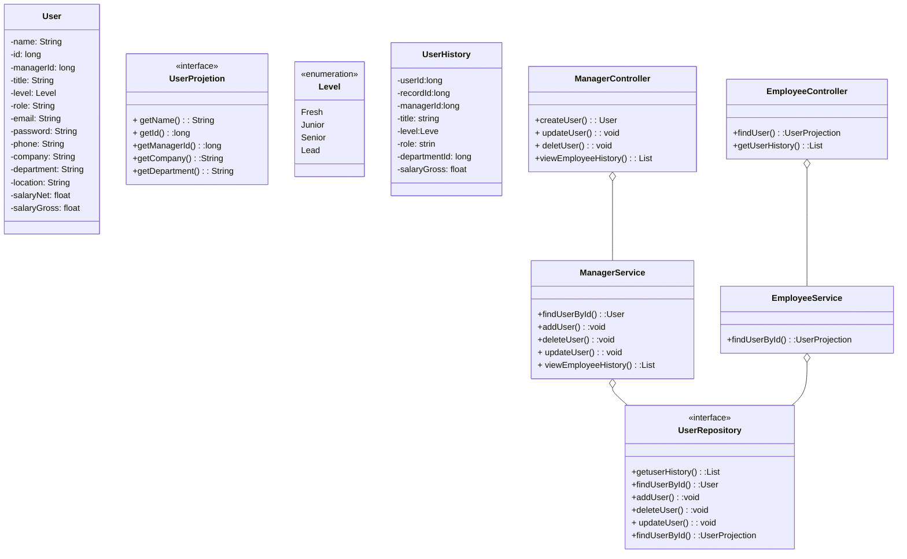

###                  Company Managment System
## User-API
# UML

```mermaid
classDiagram
class User{
-name: String
-id: long
-managerId: long
-title: String
-level: Level
-role: String
-email: String
-password: String
-phone: String
-company: String
-department: String
-location: String
-salaryNet: float
-salaryGross: float
}
class UserProjetion{
 <<interface>>
+ getName(): String
+ getId():long
+getManagerId():long
+getCompany():String 
+getDepartment(): String
}
class Level{
<<enumeration>>
Fresh
Junior
Senior
Lead
}
class UserHistory{
-userId:long
-recordId:long
-managerId:long
-title: string
-level:Leve
-role: strin
-departmentId: long
-salaryGross: float
}
class UserRepository{
<<interface>>
+getuserHistory():List<User>
+findUserById():User
+addUser():void
+deleteUser():void
+ updateUser(): void
+findUserById():UserProjection
}
class EmployeeService{
+findUserById():UserProjection
}
class ManagerService{
+findUserById():User
+addUser():void
+deleteUser():void
+ updateUser(): void
+ viewEmployeeHistory():List<User>
}
class EmployeeController{
+findUser():UserProjection
+getUserHistory():List<User>
}
class ManagerController{
+createUser(): User
+ updateUser(): void
+ deletUser(): void
+viewEmployeeHistory(): List<User>
}
ManagerService o-- UserRepository
EmployeeService o-- UserRepository
ManagerController o-- ManagerService
EmployeeController o-- EmployeeService


```
# ERD

```mermaid
erDiagram
User {
        long id PK
        string name
        long managerId FK
        string title
        int level
        string role
        string mail
        string password
        string phone
        long departmentId fk
        float salaryGross
    }
    Company{
        long id  pk
        String name  
        String Location
        string description
        }
    Department{
          long id pk
          long companyId fk
          string name
    }
    UserHistory{
        long id pk
        long recordId pk
       long managerId FK
        string title
        int level
        string role
        long departmentId fk
        float salaryGross
}
User ||--o{ Department : "belongs to"
Department ||--o{ Company : "belongs to"
User ||--o{ User : "reports to"
UserHistory ||--o{ User : "has"

```
