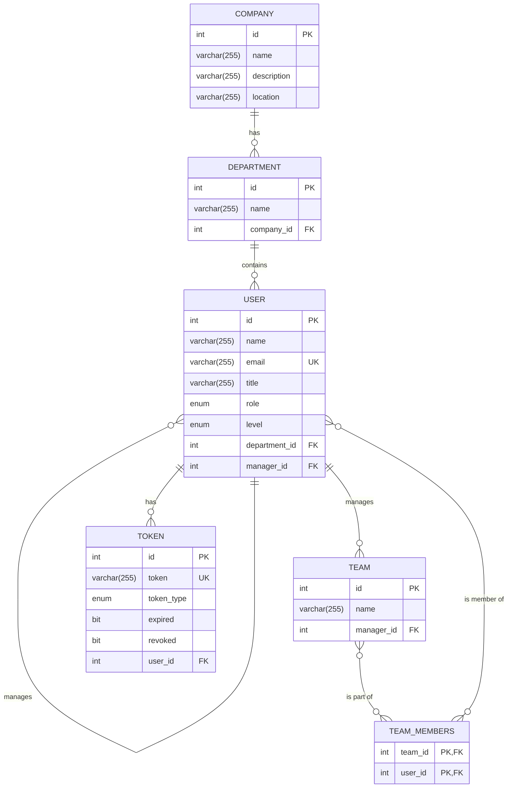

### Company Managment System
# UML 
```mermaid
classDiagram
    class Company {
        -int id
        -String name
        -String description
        -String location
    }

    class Department {
        -int id
        -String name
    }

    class User {
        -int id
        -String name
        -String email
        -String password
        -String title
        -Level level
        -Role role
    }

    class Team {
        -int id
        -String name
    }

    class Token {
        -int id
        -String token
        -TokenType tokenType
        -boolean expired
        -boolean revoked
    }

    class Level {
        <<enumeration>>
        FRESH
        JUNIOR
        LEAD
        SENIOR
    }

    class Role {
        <<enumeration>>
        COMPANY_MANAGER
        EMPLOYEE
        MANAGER
    }
    
    class TokenType {
        <<enumeration>>
        BEARER
        REFRESH
    }

    ' --- Relationships ---
    Company "1" -- "0..*" Department : has
    Department "1" -- "0..*" User : contains
    User "1" o-- "0..*" User : manages
    User "1" -- "0..*" Token : has
    Team "0..*" -- "1" User : managed by
    Team "*" -- "*" User : has members
    
    ' --- Enum Usage ---
    User ..> Level
    User ..> Role
    Token ..> TokenType
```

# ERD

