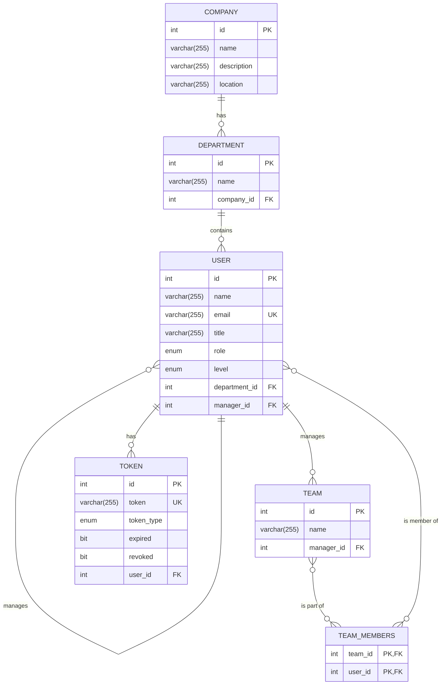

### Company Managment System
# UML 
```mermaid

class Company {
  -id: int
  -name: String
  -description: String
  -location: String
}

class Department {
  -id: int
  -name: String
}

class User {
  -id: int
  -name: String
  -email: String
  -password: String
  -phone: String
  -title: String
  -salaryGross: Float
  -level: Level
  -role: Role
}

enum Level {
  FRESH
  JUNIOR
  LEAD
  SENIOR
}

enum Role {
  COMPANY_MANAGER
  EMPLOYEE
  MANAGER
}

class Team {
  -id: int
  -name: String
}

class Token {
  -id: int
  -token: String
  -tokenType: TokenType
  -expired: boolean
  -revoked: boolean
}

enum TokenType {
  BEARER
  REFRESH
}


' Define Relationships
' ====================

' Company <--> Department
Company "1" o-- "*" Department : "has"

' Department <--> User
Department "1" o-- "*" User : "contains"

' User <--> User (Self-referencing for manager)
User "1" o-- "*" User : "manages >"

' User <--> Team (Manager of Team)
User "1" o-- "*" Team : "manages"

' User <--> Token
User "1" o-- "*" Token : "has"

' Team <--> User (Many-to-Many for members)
Team "1" *-- "*" User : "< has members"


' Connect Enums to User class
User .> Level
User .> Role
Token .> TokenType

```

# ERD

