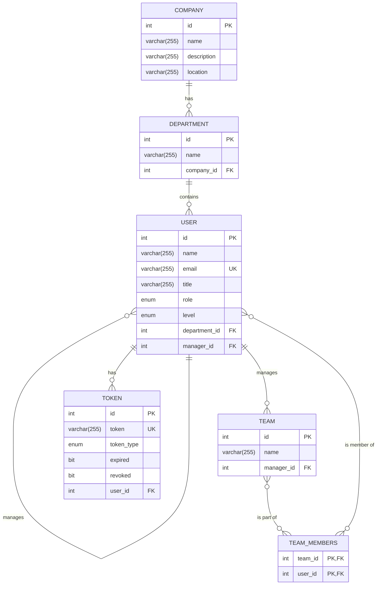

### Company Managment System
# UML 
```mermaid

 classDiagram
    direction TD

    subgraph "Controller Layer"
        class TeamController {
            +assignManagerToTeam(teamId, managerId): TeamDto
            +createTeam(teamDto): TeamDto
            +getTeamById(teamId): TeamDto
        }
        class UserController {
            +getUserById(id): UserResponseDto
        }
    end

    subgraph "Service Layer"
        class TeamService {
            +assignManagerToTeam(teamId, managerId): TeamDto
            +createTeam(teamDto): TeamDto
        }
        class UserService {
             +getUserById(id): UserResponseDto
        }
    end

    subgraph "Repository (DAO) Layer"
        class JpaRepository {
            <<interface>>
            +findById(ID id)
            +findAll()
            +save(S entity)
        }
        class TeamRepository {
            <<interface>>
            +findByManagerId(int managerId): List
        }
        class UserRepository {
            <<interface>>
            +findUserById(int id): Optional
        }
    end
    
    subgraph "Mapper Layer"
        class TeamMapper {
            <<interface>>
            +teamToTeamDto(Team team): TeamDto
        }
        class UserMapper {
            <<interface>>
            +toUserResponseDto(User user): UserResponseDto
        }
    end


    ' --- Relationships ---

    ' Controller depends on Service
    TeamController o-- TeamService
    UserController o-- UserService

    ' Service depends on Repository
    TeamService o-- TeamRepository
    TeamService o-- UserRepository
    UserService o-- UserRepository

    ' Service depends on Mapper
    TeamService o-- TeamMapper
    UserService o-- UserMapper

    ' Repository Inheritance from Spring Data JPA
    JpaRepository <|-- TeamRepository
    JpaRepository <|-- UserRepository

```

# ERD

