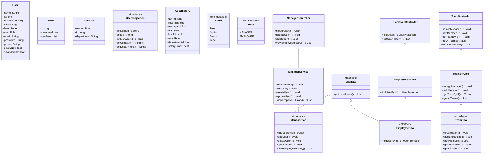
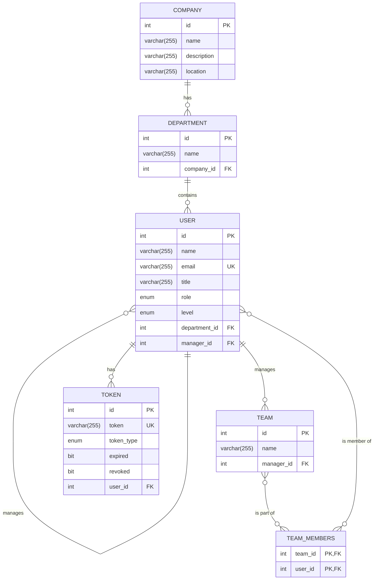

### Company Managment System
# UML 

```mermaid
classDiagram
    class User {
        -name: String
        -id: long
        -managerId: long
        -title: String
        -level: Level
        -role: Role
        -email: String
        -password: String
        -phone: String
        -salaryNet: float
        -salaryGross: float
    }
    class Team {
        -id: long
        -managerId: long
        -members: List
    }
    class UserDto {
        +name: String 
        +id: long
        +department: String
    }
    class UserProjection {
        <<interface>>
        +getName(): String
        +getId(): long
        +getManagerId(): long
        +getCompany(): String
        +getDepartment(): String
    }
    class UserHistory {
        -userId: long
        -recordId: long
        -managerId: long
        -title: string
        -level: Level
        -role: Role
        -departmentId: long
        -salaryGross: float
    }
    class Level {
        <<enumeration>>
        Fresh
        Junior
        Senior
        Lead
    }
    class Role {
        <<enumeration>>
        MANAGER
        EMPLOYEE
    }

    class ManagerController {
        +createUser(): User
        +updateUser(): void
        +deletUser(): void
        +viewEmployeeHistory(): List<User>
    }
    class EmployeeController {
        +findUser(): UserProjection
        +getUserHistory(): List<User>
    }
    class TeamController {
        +assignManager(): void
        +addMember(): void
        +getTeamById(): Team
        +getAllTeams(): List<Team>
        +removeMember(): void
    }

    class ManagerService {
        +findUserById(): User
        +addUser(): void
        +deleteUser(): void
        +updateUser(): void
        +viewEmployeeHistory(): List<User>
    }
    class EmployeeService {
        +findUserById(): UserProjection
    }
    class TeamService {
        +assignManager(): void
        +addMember(): void
        +getTeamById(): Team
        +getAllTeams(): List<Team>
    }

    class UserDao {
        <<interface>>
        +getuserHistory(): List<User>
    }
    class ManagerDao {
        <<interface>>
        +findUserById(): User
        +addUser(): void
        +deleteUser(): void
        +updateUser(): void
        +viewEmployeeHistory(): List<User>
    }
    class EmployeeDao {
        <<interface>>
        +findUserById(): UserProjection
    }
    class TeamDao {
        <<interface>>
        +createTeam(): void 
        +assignManager(): void
        +addMember(): void
        +getTeamById(): Team
        +getAllTeams(): List<Team>
    }

    UserDao <|-- EmployeeDao
    UserDao <|-- ManagerDao
    
    ManagerController o-- ManagerService
    EmployeeController o-- EmployeeService
    TeamController o-- TeamService
    
    ManagerService o-- ManagerDao
    EmployeeService o-- EmployeeDao
    TeamService o-- TeamDao
    
```

# ERD

```mermaid
erDiagram
    COMPANY {
        int id PK
        varchar(255) name
        varchar(255) description
        varchar(255) location
    }

    DEPARTMENT {
        int id PK
        varchar(255) name
        int company_id FK
    }

    USER {
        int id PK
        varchar(255) name
        varchar(255) email UK
        varchar(255) title
        enum role
        enum level
        int department_id FK
        int manager_id FK
    }

    TEAM {
        int id PK
        varchar(255) name
        int manager_id FK
    }

    TOKEN {
        int id PK
        varchar(255) token UK
        enum token_type
        bit expired
        bit revoked
        int user_id FK
    }

    TEAM_MEMBERS {
        int team_id PK, FK
        int user_id PK, FK
    }

    COMPANY ||--o{ DEPARTMENT : "has"
    DEPARTMENT ||--o{ USER : "contains"
    USER }o--|| USER : "manages"
    USER ||--o{ TEAM : "manages"
    USER ||--o{ TOKEN : "has"
    
    TEAM }o--o{ TEAM_MEMBERS : "is part of"
    USER }o--o{ TEAM_MEMBERS : "is member of"

```
